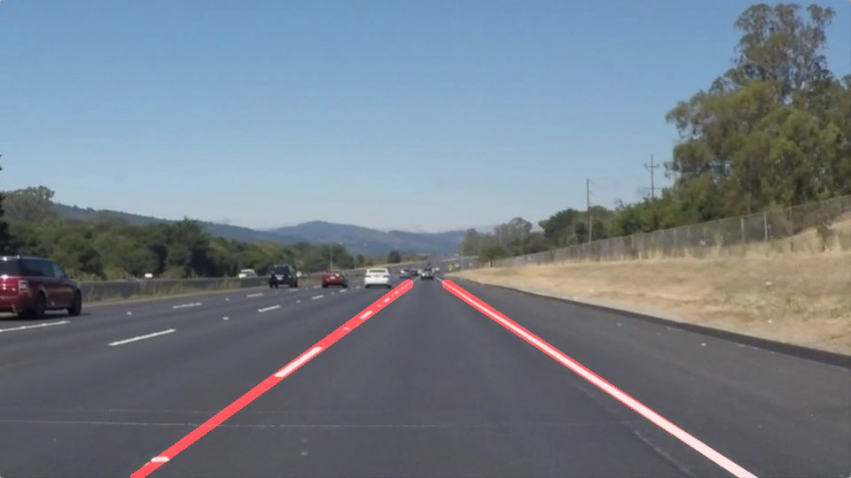
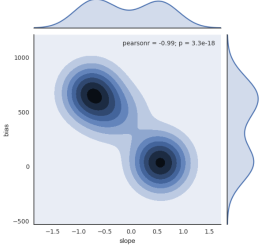

#**Finding Lane Lines on the Road**
[](http://www.udacity.com/drive)


<link rel="stylesheet" href="./mermaid/dist/mermaid.forest.css"/>

<script src="./mermaid/dist/mermaid.js"></script>
<script>
    var config = {
        startOnLoad:true,
        callback:function(id){
            console.log(id,' rendered');
        },
        flowchart:{
            useMaxWidth:false,
            htmlLabels:true
        },
        logLevel:5
    };
    mermaid.initialize(config);
</script>

<script>
	function coolAction(){
		console.log('Got callback in user defined function');
	}
</script>

<style>
        .cluster {
            fill: #fcac93;
            rx:4px;
            stroke: grey;
        }
</style>


The Project
---

Code were put in P1.ipynb and writeup in writeup.md/README.md.

As writeup.md described, in P1.ipynb, two pipelines were built. 

The first model performed well on white.mp4 and yellow.mp4, but not good for challenge.mp4.

So a new pipeline were built and good result were got for challenge.mp4 in extra.mp4.

The new pipeline also performed well in white_challenge.mp4 and yellow_challenge.mp4


# Finding Lane Lines on the Road

---

**Finding Lane Lines on the Road**

The goal of this project is to **make a pipeline that finds lane lines (left and right) on the road**.

To achieve this overall goal, this project were divided into three steps, including:

* Identify lane lines on both left side and right side of the car on the road for several pictures.
* Identify lane lines on a short movie using our pipeline.
* Improve this pipeline using another movie with  more complex condition on the road.


---


## 1. Identify lane lines on both left side and right side of the car on the road for several pictures


My first pipeline mainly consisted of 4 steps, which could be described in the flowchart below:

<div style="width:200px">
<div class="mermaid" id="i141">

        graph TD

        %% Example diagram
        %%A["test(vcc) a a "] -- Link text --> B((Circle));
        %%A --> C(Round Rect)
        %%A --> E(- Elipse -)
        %%click A coolAction
        %%B --> D{Rhombus}
        %%C --> D
        %%A --> B
       A["Raw images"] -- "GrayScale + GaussianBlur + Canny" --> B["Canny Gradient"]
       B-- "ROI"--> C["Canny Gradient of Interest"]
       C -- "HoughLinesP" --> D["Candidate Lane Lines"]
       D -- "draw_lines()" --> E["Road Lane Lines"]
</div>
</div>

Next, all steps will be introduced in detail:

### 1.1. Step1:

First, I converted the images to grayscale using ```cv2.cvtColor(img, cv2.COLOR_RGB2GRAY)```, then a gaussian noise kernel was applied in the grayscaled image to smooth the border of each object in this image using ```cv2.GaussianBlur(img, (5，5))``` and the intensity gradient of the image were detected on the resulting image using ```cv2.Canny(img, 50, 150)``` .


### 1.2. Step2:

As there could be many lane lines on the road, and what we really need to focus on is only the current road lane. So a ladder-shaped vertice were applied to only keep the region defined by the polygon formed region, which we called __region of interests(ROI)__, and the rest is set to black using the function ```cv2.fillPoly(mask, vertices, ignore_mask_color)``` and ```cv2.bitwise_and(img, mask)```.

The four nodes for this ladder shaped vertice were defined as:

$$ [(\frac{9}{19}dim_x, \frac{10}{19}dim_y), (\frac{10}{19}dim_x, \frac{10}{19}dim_y), (0, dim_y), (dim_x, dim_y) ]  $$

Looks like:


### 1.3. Step3:

Detecting long-direct lines in the intensity-gradient plot of region of interest using Hough transform algorithm.

[Hough Transform](https://en.wikipedia.org/wiki/Hough_transform), means:

-   Generate a numbers of lines passing a point at different angels ($$\theta$$).
-   For each line, its perpendicular-line was drawn to the zero point, the distance of it to the zero point is ($$\rho$$)


-   So we get a group of ($$\theta, \rho$$) pairs, with different for each point. The intersect position for these three lines is considered to be the slope of the perpendicular line and its distance to the zero point.


Results for ```cv2.HoughLinesP``` using parameters ```rho = 1```, ```theta = Pi/180```, ```threshold = 50```, ```min_line_len = 10 ``` and ```max_line_gap = 60```:


### 1.4. Step4:

In order to draw a single line on the left and right lanes, I was informed to modify the draw_lines() function instead of a serious of lines on the image in step3. So before we merge that, let's analysis the input lines in detail:

There are 21 resulting lines after step3 for ```whiteCarLaneSwith.jpg```. Let's take a look


 num | x1	|y1|	x2|	y2
---|---|---|---|---
0  |	195	| 539	|480|	316
1  |	743	| 467	|863|	539
2  |	176	| 538	|364|	397
3  |	752	| 465	|884|	538
4  |	176	| 539	|374|	390

We found:

- A strong co-linearity for these resulting lines.
- A group of lines on the left for left lane line  and the same for right.
- Some noise introduced by the existence of other objects, but not so long.

To present these kind of co-linearty, some **feature engineering** were performed for the 4 columns of these data. ```slope```, ```bias``` and ```length``` for these lines were calculated using some basic mathmatics.

```python
pd_lines['length']   = pd_lines.apply(lambda x: (x.x2-x.x1)**2+(x.y2-x.y1)**2, axis=1)**0.5
pd_lines['slope']    = pd_lines.apply(lambda x: (x.y2-x.y1) / (x.x2-x.x1), axis=1)
pd_lines['bias']     = pd_lines.apply(lambda x: (x.y1-x.slope*x.x1), axis=1)
pd_lines['interval'] = pd_lines.apply(lambda x: int(x.length/10), axis=1)

```

Furthermore, lines were divided into intervals each 10 pixel in order to increase the weight for long lines for average and/or extrapolate the line segment.

```python
l_slope = np.array([ pd_lines.iloc[row_i]['slope']   for row_i in range(pd_lines.shape[0])
                                                     for col_i in range(int(pd_lines.iloc[row_i]['interval']))  ])

l_bias  = np.array([ pd_lines.iloc[row_i]['bias']    for row_i in range(pd_lines.shape[0])
                                                     for col_i in range(int(pd_lines.iloc[row_i]['interval']))  ])

```

This could help reducing the variation for resulting ```slope``` and ```bias```

Raw| After divide into 10-pixel intervals
---|---
 | 

The final slope and bias for lines on the left side were then calculated using the median value to avoid the influence of outliers on average value:

```python
b1 = np.median(l_bias[l_slope >0])
s1 = np.median(l_slope[l_slope>0])
b2 = np.median(l_bias[l_slope <0])
s2 = np.median(l_slope[l_slope<0])
```

Then the line were plotted on just ROI:

```python
l_params = [[b1, s1], [b2, s2]]

y_top    = min( min(pd_lines['y1']), min(pd_lines['y2']) )
y_bottom = max( max(pd_lines['y1']), max(pd_lines['y2']) )
x_top1   = int((y_top    - l_params[0][0]) / l_params[0][1])
x_top2   = int((y_top    - l_params[1][0]) / l_params[1][1])
x_bottom1= int((y_bottom - l_params[0][0]) / l_params[0][1])
x_bottom2= int((y_bottom - l_params[1][0]) / l_params[1][1])

cv2.line(img, (x_top1, y_top), (x_bottom1, y_bottom),    color, thickness)
cv2.line(img, (x_top2, y_top), (x_bottom2, y_bottom), color, thickness)

```

Result:


## 2. Identify lane lines on a short movie using our pipeline

I used this pipeline to add lane lines on a short movie directly. Seemed performed well.


## 3. Improve this pipeline using another movie with  more complex condition on the road.

Not well for challenge data, so I tried to debug. I converted this short film into jpgs and tried to find out why in a single picture.

Movie => jpg conversion:

```python
!mkdir challenge
clip2 = VideoFileClip('challenge.mp4')
clip2.write_images_sequence("challenge/frame%04d.jpeg")

```

I select the 125th image to analysis why the previous model performed not well:


This picture is quite representative, it almost exposed all problems in my previous model, including:

1. Yellow line in the left side is not detected in roads brighter than usual.

2. The gradient introduced by different materials. For example, the boundary between the cement road(bright) and bitumen(dark) on the road, will also introduced a noise for canny function in OpenCV.

3. The shadow of other objects on the road, like the shadow of trees, will also introduced a difference in gray gradient, which would also be detected by the canny function in OpenCV.

4. The vertices for region of interest should be upper to avoid the effect of the car itself in this image at the bottom.

I noticed that in the introduction part of this notebook, I was informed that:

```
Some OpenCV functions (beyond those introduced in the lesson) that might be useful for this project are:
cv2.inRange() for color selection
cv2.fillPoly() for regions selection
cv2.line() to draw lines on an image given endpoints
cv2.addWeighted() to coadd / overlay two images cv2.cvtColor() to grayscale or change color cv2.imwrite() to output images to file
cv2.bitwise_and() to apply a mask to an image
```

Yes, what I need is a color selector! The lanes on the road is mainly white and yellow, and if I only focus on the gradient for the changing of these two colors, the result should be much cleaner!

So I searched in google for the usage of [cv2.inRange](http://opencv-python-tutroals.readthedocs.io/en/latest/py_tutorials/py_imgproc/py_colorspaces/py_colorspaces.html) and studied what is [HSV color-space](https://en.wikipedia.org/wiki/HSL_and_HSV)


and how to perform color selection like this:


Then, the whole pipeline were rebuilt like this:


<div style="width:200px">
<div class="mermaid" id="i141">
        graph TD

       A["Raw images"] -- "RGB2HSV" --> A1["HSV format"]
       A1 -- "inRange([10,120,70], [40,255,255])" --> A2["Yellow Panel"]
       A1 -- "inRange([0,0,180], [255,25,255])" --> A3["White Panel"]
       A2 --"bitwise_or"--> A4["Merged Panel"]
       A3 --"bitwise_or"--> A4
       A4 --"GaussianBlur + Canny" --> B["Canny Gradient"]
       B-- "ROI"--> C["Canny Gradient of Interest"]
       C -- "HoughLinesP" --> D["Candidate Lane Lines"]
       D -- "draw_lines()" --> E["Road Lane Lines"]
</div>
</div>

Some parameters were also changed:

```python
vertices = np.array([[
        (image.shape[1]*1/6,   image.shape[0]*17/19),
        (image.shape[1]*9/19,  image.shape[0]*11/19),
        (image.shape[1]*10/19, image.shape[0]*11/19),
        (image.shape[1]*5/6,   image.shape[0]*17/19)
]])

kernelSize = 5
low_threshold  =  30
high_threshold = 100

rho = 1
theta = np.pi / 180
threshold = 20
min_line_len = 10
max_line_gap = 60

lower_yellow = np.array([10,120,70])
upper_yellow = np.array([40,255,255])

lower_White = np.array([0,0,180])
upper_White = np.array([255,25,255])

```

The new model seemed to perform well in 125th image:


as well as the challenge.mp4


## 4. Identify potential shortcomings with your current pipeline

Some potential shortcomings would be what would happen when:

1. This pipeline may get into trouble when encountering complex road lane line, like go through crossroad.
2. More images were required for different weather condition, like raining or evening, because road lane line would showed different feature in HSV space under the light of the car lamp or road lamp and the reflaction of light because of water on the road would also puzzle this pipeline.
3. If there is a car in front of the self-driving car, which hides the road lane line, this pipeline would also get into trouble.


## 3. Suggest possible improvements to your pipeline

More images and movies in all different weather conditions and complex road line in crossroad could help improve the adaptability to different conditions.

To avoid the influence of other cars which could hide the line on the road, another potential improvement could be connecting this pipeline with the driving system, like slow-down when another car on the road hided the lane line.
